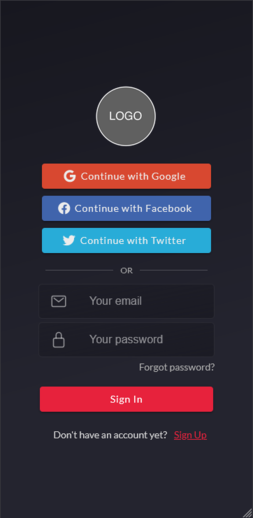
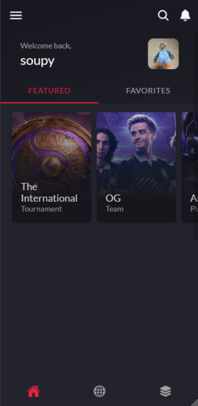
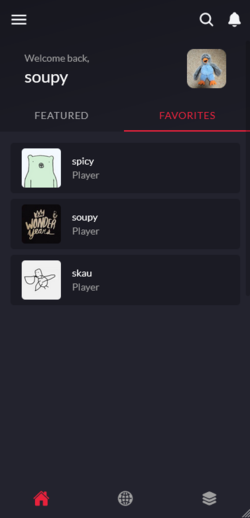
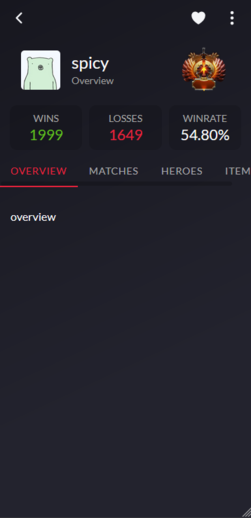
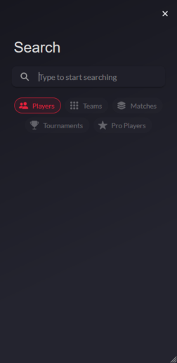

# Dotalite - Cross-platform mobile application for Dota 2 stats

## Screenshots

  

## Technologies

### Frontend

- Angular
- Ionic
- TypeScript
- SCSS

### Backend

- Express.js
- PostgreSQL
- Prisma
- TypeScript

## Usage

`git clone https://github.com/niemelsa/dotalite-mobile.git`  
`npm install`  
`ionic serve`
